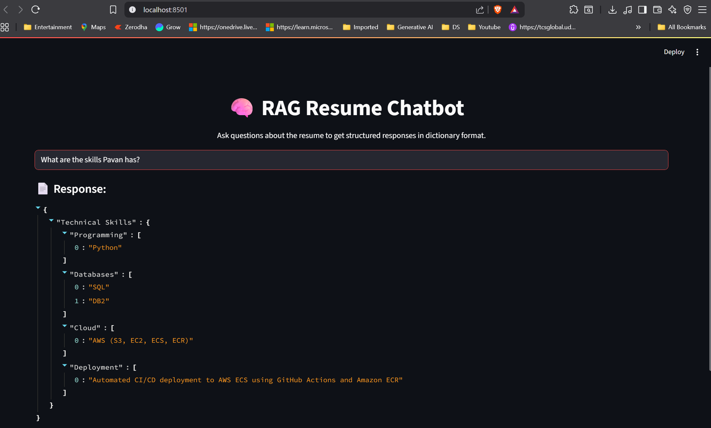
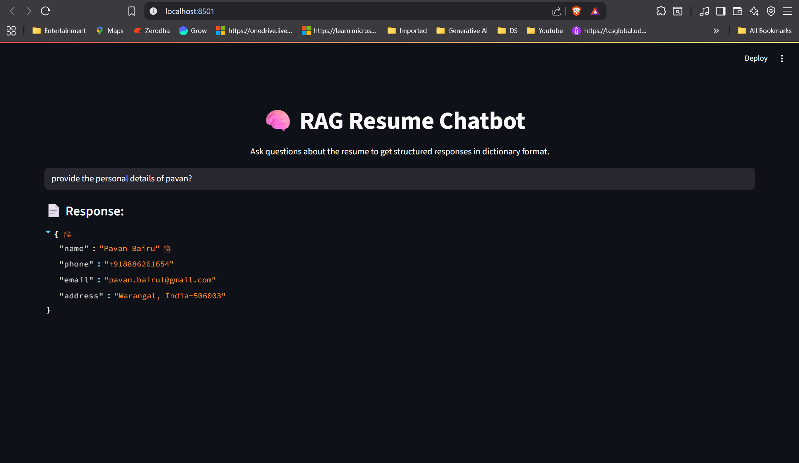

# 🧠 RAG Resume Chatbot

A **Retrieval-Augmented Generation (RAG)**-based chatbot that answers questions about a given resume in a **structured Python dictionary format**.  
It uses **LangChain**, **Euriai API**, and **Streamlit** to load a resume, chunk it into searchable embeddings, and provide precise responses to queries.

---

## 📌 Features

- **PDF Resume Parsing** – Reads and splits your resume into searchable chunks.  
- **Vector Search with Chroma** – Enables semantic search for relevant resume sections.  
- **Custom Prompt Engineering** – Ensures responses are always in valid Python dictionary format.  
- **Structured Responses** – Skills, projects, education, certifications, and more are clearly extracted.  
- **Streamlit UI** – Simple web interface to ask questions and view answers.

---

## 🛠️ Tech Stack

- **Python 3.10**
- **Streamlit** – Web UI
- **LangChain** – RAG pipeline
- **Chroma** – Vector database
- **Euriai API** – LLM & embeddings
- **PyPDFLoader** – PDF reading
- **RecursiveCharacterTextSplitter** – Document chunking

---

## 📂 Project Structure

```
📦 resume-rag-chatbot
├── data/
│   └── Pavan_Bairu_Resume.pdf      # Resume to be processed
├── main.py                         # Streamlit app
├── .env                            # API keys and config
├── requirements.txt                # Dependencies
└── README.md                       # Documentation
```

---

## ⚙️ Installation & Setup

1️⃣ **Clone the repository**
```bash
git clone https://github.com/your-username/resume-rag-chatbot.git
cd resume-rag-chatbot
```

2️⃣ **Create a virtual environment**
```bash
python -m venv venv
source venv/bin/activate    # macOS/Linux
venv\Scripts\activate     # Windows
```

3️⃣ **Install dependencies**
```bash
pip install -r requirements.txt
```

4️⃣ **Set up environment variables**  
Create a `.env` file in the root directory:
```env
EURIAI_API_KEY=your_euriai_api_key_here
```

5️⃣ **Add your resume**  
Place your resume PDF in the `data/` folder and name it:
```
Pavan_Bairu_Resume.pdf
```

6️⃣ **Run the app**
```bash
streamlit run main.py
```

---

## 📋 Example Queries

- "What are the skills Pavan has?"
- "List all certifications"
- "Give details about projects"
- "What is the education background?"
- "What experience does he have at TCS?"

---

## 🖼️ Screenshot
- "What are the skills Pavan has?"


- "provide the personal details of pavan?"



